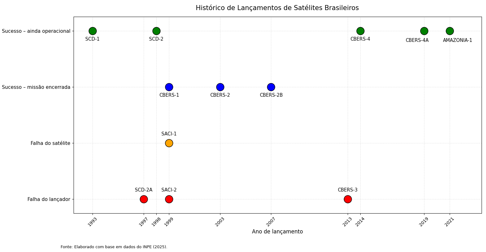

## Sobre o projeto

Este repositório apresenta uma visualização histórica dos principais satélites brasileiros lançados no âmbito do Programa Nacional de Atividades Espaciais (PNAE), com destaque para o ano de lançamento e o resultado geral de cada missão.

O gráfico foi desenvolvido em **Python**, utilizando a biblioteca **Matplotlib**, com o objetivo de transformar dados históricos em uma representação visual simples, permitindo identificar rapidamente períodos de sucesso, falhas de lançamento, falhas de satélite e missões que permanecem operacionais.

## Fonte dos dados

Os dados utilizados foram obtidos principalmente a partir de informações oficiais disponibilizadas pelo **Instituto Nacional de Pesquisas Espaciais (INPE)**, especialmente na página:

**“Satélites lançados ao espaço no âmbito do Programa Nacional de Atividades Espaciais”**

A página institucional do INPE reúne informações como nome da missão, data de lançamento, veículo lançador, status do lançamento e situação operacional dos satélites.

Para o **AMAZONIA-1**, também foram consideradas informações institucionais disponibilizadas pelo próprio INPE relativas ao lançamento realizado em 28 de fevereiro de 2021.

Fonte principal:

**INSTITUTO NACIONAL DE PESQUISAS ESPACIAIS – INPE. Satélites lançados ao espaço no âmbito do Programa Nacional de Atividades Espaciais. São José dos Campos: INPE, 2025.**
https://www.gov.br/inpe/pt-br/area-conhecimento/posgraduacao/ete/satelites-lancados-ao-espaco-no-ambito-do-programa-nacional-de-atividades-espaciais

## Satélites representados

A visualização contempla as seguintes missões:

* SCD-1
* SCD-2A
* SCD-2
* SACI-1
* SACI-2
* CBERS-1
* CBERS-2
* CBERS-2B
* CBERS-3
* CBERS-4
* CBERS-4A
* AMAZONIA-1

## Classificação utilizada

Para facilitar a interpretação visual, as missões foram agrupadas em quatro categorias:

* **Sucesso – ainda operacional:** lançamento realizado com sucesso e satélite ainda em operação segundo os dados utilizados.
* **Sucesso – missão encerrada:** lançamento bem-sucedido, mas com missão posteriormente encerrada.
* **Falha do satélite:** lançamento realizado, porém a missão foi comprometida por falha associada ao satélite.
* **Falha do lançador:** a missão não alcançou seu objetivo devido a falha no veículo lançador.

Essa classificação procura distinguir o **resultado do lançamento** da **situação posterior da missão**, evitando tratar “operacional” e “sucesso” como categorias equivalentes.

## Desenvolvimento

O gráfico foi produzido utilizando:

* **Python**
* **Matplotlib**

Cada missão é representada de acordo com seu ano de lançamento e sua classificação histórica. Os rótulos de algumas missões foram reposicionados apenas para melhorar a legibilidade da visualização, sem alterar os valores correspondentes aos anos de lançamento.

O arquivo é exportado em resolução de **300 dpi**, adequada para utilização em documentos acadêmicos, apresentações e publicações.

## Finalidade

O objetivo deste projeto é fornecer uma representação visual da trajetória dos satélites brasileiros associados ao Programa Espacial Brasileiro, destacando tanto os avanços tecnológicos alcançados quanto as dificuldades enfrentadas ao longo das diferentes missões.

A visualização também pode ser utilizada como apoio a estudos sobre o desenvolvimento do Programa Espacial Brasileiro, políticas espaciais, capacidade tecnológica nacional e evolução histórica das missões orbitais brasileiras.

## Observação

Este gráfico constitui uma **elaboração própria a partir de dados institucionais públicos**. O código desenvolvido neste repositório é responsável apenas pelo tratamento e pela representação gráfica das informações.

Para trabalhos acadêmicos, recomenda-se citar diretamente a fonte institucional original dos dados.

**Fonte do gráfico:** Elaborado pelo autor com base em dados do Instituto Nacional de Pesquisas Espaciais – INPE (2025).
